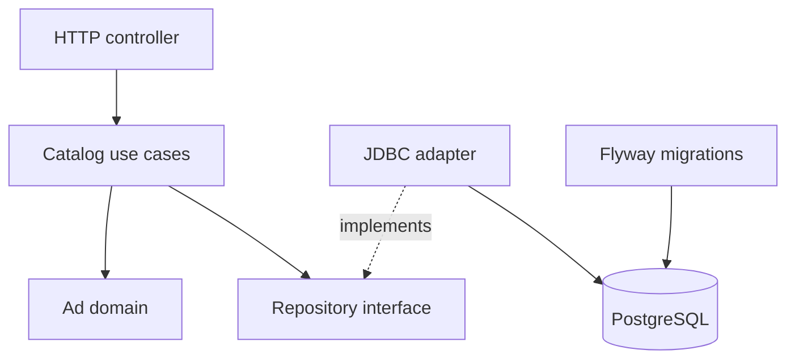
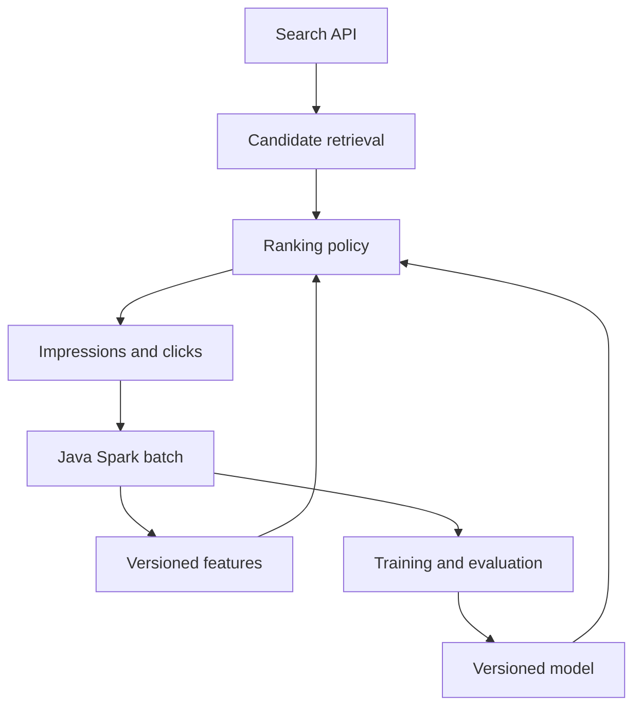

# Architecture and contracts

## Implemented application foundation

The application contains a PostgreSQL-backed catalog with create/read HTTP
operations, input validation, consistent error responses, and health endpoints.
The application service and domain use only Java. HTTP and JDBC are adapters;
Spring configuration supplies the repository and UTC clock.

The catalog packages are `catalog.api`, `catalog.application`, `catalog.domain`,
and `catalog.infrastructure`. The root `api` package owns shared HTTP error
handling. The application service waits for a successful insert before returning
an ad. A single parameterized statement is the current write transaction.

UUIDs identify ads; title and category are not uniqueness keys. Timestamps are
UTC with microsecond precision. The catalog's `ads` table is not an impression
log, click log, or feature store. Those require their own contracts.

See [API semantics](api.md), [operational behavior](operations.md), and the
[foundation decision](decisions/0001-application-foundation.md). Runtime
integration verification remains pending in the current environment; see
[development and verification](development.md).

## Target search-ranking architecture

The flow below describes future platform components. Standalone Java Spark
references exist for selected data transformations; they are not yet integrated
with the catalog application or deployed as a feature pipeline.

Event logging represents observed exposures and later interactions, with explicit
identifiers and attribution rules. Returning an item from the API is not itself
proof that a user saw it. Experiment assignment and monitoring are later additions
around these boundaries; see the [learning path](learning-path.md).

## Make boundaries explicit

| Boundary | Required contract |
| --- | --- |
| Request to candidates | Query, request ID, eligibility filters, candidate limit, deterministic baseline |
| Candidates to ranking | Feature names/types, missing-value policy, snapshot ID, score meaning, tie-breaker |
| Ranking to exposure events | Request and impression IDs, item, position, policy/model version, event and receipt timestamps |
| Events to batch metrics | Unique IDs or version rules, valid attribution window, cohort, reporting cutoff, invalid-data policy |
| Batch to feature snapshot | Feature definition version, source snapshot, event-time coverage, availability time, complete-publication marker |
| Features to training | Point-in-time availability, label maturity, split boundaries, preprocessing fitted only on training data |
| Training to serving | Model and preprocessing versions, input schema/order, compatibility checks, fallback and rollback target |

## Keep the batch and request paths separate

The HTTP path will read a completed, compatible feature snapshot and model.
It should not launch a Spark job per request. The batch runner has its own
Spark classpath and lifecycle; it does not add Spark libraries to the current
Spring starter.

Begin with local fixtures and versioned files. Introduce a database, object
store, event bus, or feature service when a concrete stage needs its guarantees.
Publishing safely means choosing a mechanism appropriate to that storage system:
a complete immutable snapshot plus an atomic/version-checked pointer is one
option. Do not assume object storage has filesystem rename semantics.

The next feature should establish impression and click event contracts before
connecting catalog data to analytics. Each additional component needs a concrete
input/output contract and an acceptance check.
