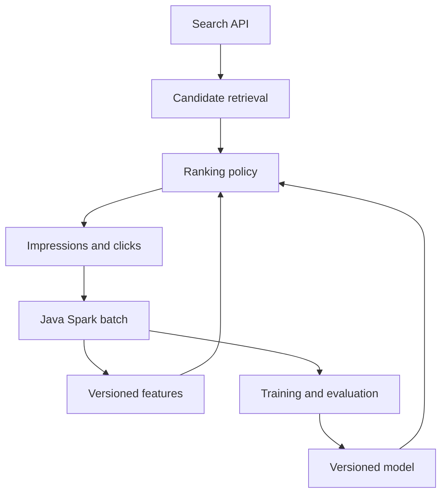

# Target architecture and contracts

This is the intended architecture as the learning stages are completed. Today,
the repository contains a Spring application scaffold and standalone Java Spark
labs. The services and production paths below are not implemented yet.

Event logging represents observed exposures and later interactions, with explicit
identifiers and attribution rules. Returning an item from the API is not itself
proof that a user saw it. Experiment assignment and monitoring are later additions
around these boundaries; see the [learning path](learning-path.md).

## Make boundaries explicit

| Boundary | Required contract |
| --- | --- |
| Request to candidates | Query, request ID, eligibility filters, candidate limit, deterministic baseline |
| Candidates to ranking | Feature names/types, missing-value policy, snapshot ID, score meaning, tie-breaker |
| Ranking to exposure events | Request and impression IDs, item, position, policy/model version, event and receipt timestamps |
| Events to batch metrics | Unique IDs or version rules, valid attribution window, cohort, reporting cutoff, invalid-data policy |
| Batch to feature snapshot | Feature definition version, source snapshot, event-time coverage, availability time, complete-publication marker |
| Features to training | Point-in-time availability, label maturity, split boundaries, preprocessing fitted only on training data |
| Training to serving | Model and preprocessing versions, input schema/order, compatibility checks, fallback and rollback target |

## Keep the batch and request paths separate

The HTTP path will read a completed, compatible feature snapshot and model.
It should not launch a Spark job per request. The batch runner has its own
Spark classpath and lifecycle; it does not add Spark libraries to the current
Spring starter.

Begin with local fixtures and versioned files. Introduce a database, object
store, event bus, or feature service when a concrete stage needs its guarantees.
Publishing safely means choosing a mechanism appropriate to that storage system:
a complete immutable snapshot plus an atomic/version-checked pointer is one
option. Do not assume object storage has filesystem rename semantics.

The first acceptance condition is an accurate metric with a defensible data
contract. More infrastructure becomes useful after that foundation is reliable.
