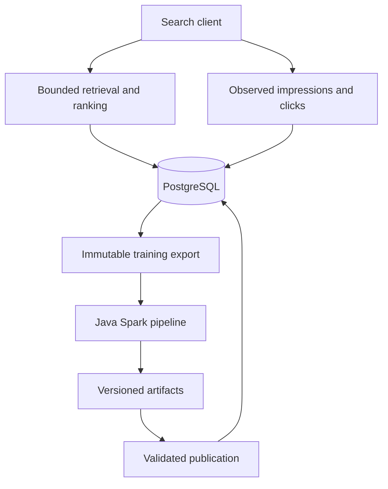

# Architecture

The platform is a modular Spring application and an independently executed
Java/Spark batch runner. PostgreSQL owns transactional online state. There is no
broker or remote feature service in the request path.

## Module responsibilities

| Package/process | Owns |
| --- | --- |
| `catalog` | Ad invariants, create/read API and JDBC repository adapter |
| `search` | Candidate cap, policy selection, feature defaults, stable ordering and provenance |
| `events` | Deduplication, attribution, mature metrics and immutable export materialization |
| `features` | Validated complete snapshots, freshness and bounded lookups |
| `ml` | Shared Java scoring contract, immutable registry, validation gate and deployment revisions |
| `experiments` | Frozen allocation definitions, persistent assignments, reports and stop control |
| `platform` / `api` | HTTP adapters, administrative access and Problem Details |
| `analytics` | Spark validation, Parquet, aggregation, training, model selection and evaluation |

The catalog domain, `ClickModel` and `ExperimentStatistics` use plain Java.
Transaction-oriented services use explicit Spring JDBC. The batch runner
compiles the actual `ClickModel` source used by the application, avoiding a
separate feature-order or preprocessing implementation.

## Online path

1. Validate query, opaque user ID and result limit. A GIN index supports `simple`
   full-text matching. Retrieve at most 200 candidates by text score and UUID.
2. Resolve an experiment assignment or the default deployment once. Select one
   compatible, complete feature snapshot available at request time.
3. Build text relevance, smoothed CTR and log impression count. Missing per-ad
   history uses explicit defaults. Exclude snapshots older than 24 hours.
4. Score with an immutable model or the baseline, then break ties by UUID. Store
   returned rows and their exact features with request/assignment provenance.
5. Later events reference returned results. Search itself creates no impression.

The database is required for catalog retrieval and durable logging; its failure
returns `503`. Missing/stale features or an unusable model trigger a baseline
with traceable fallback reasons. This is lexical retrieval, not semantic or
multilingual retrieval.

## Consistency boundaries

| Operation | Guarantee |
| --- | --- |
| Event retry | Uniqueness plus payload comparison; identical delivery reuses identity; conflicts return `409` |
| Search | Assignment, request and returned feature vectors commit together |
| Training export | One `INSERT SELECT` freezes an MVCC view; pagination reads immutable payloads |
| Feature publication | Metadata and all rows commit together; partial snapshots are invisible |
| Model registration | JSON artifact and hash are immutable under a version |
| Promotion/rollback | Expected revision prevents lost updates; history and pointer commit together |
| Local batch output | Completion manifest plus atomic directory move on one filesystem |

Atomic local moves are not an object-storage contract. A future object store
needs immutable objects and conditional manifest/pointer publication. Exports
record the truth visible at a specified snapshot/cutoff; they do not assert that
business data can never later be revised.

## Scale and extension points

Bounds are 10,000 feature rows per publication, 100,000 examples per frozen
export, 5,000 examples per page and 50 returned results. Feature imports use a
set-based insert. Fitting, evaluation and scoring parity aggregate in Spark;
only bounded feature publication and small reports collect to the driver.

Before raising these limits, measure query plans, connection demand, publication
size, storage growth and shuffle behavior. Large retained logs may justify time
partitioning and object-store exports. Independent retrieval scale may justify
a search index. Add Kafka when ingestion, replay or consumer fan-out requires it.

The local API has no end-user identity verification or tenant isolation. The
admin token is not organization-wide RBAC. External hosting requires TLS, secret
management, quotas, retention/deletion enforcement, backup/restore validation
and measured SLOs.
